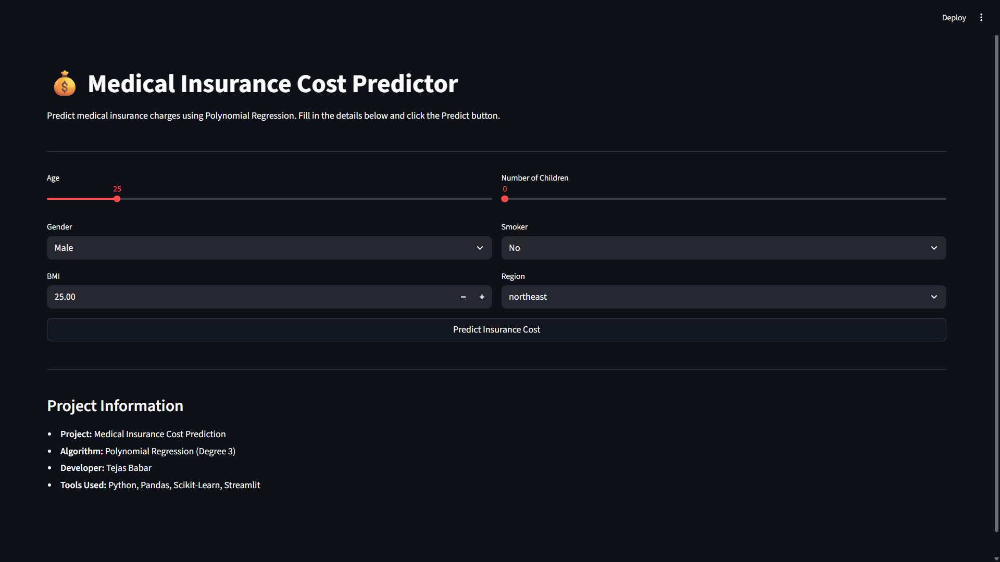
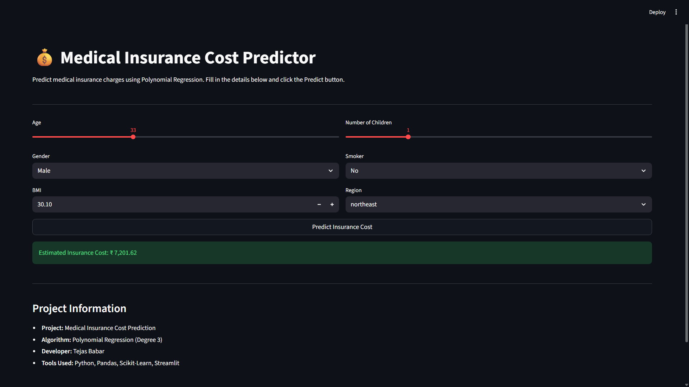

# 🏥 Insurance Cost Prediction using Polynomial Regression

A Machine Learning web application that predicts an individual's medical insurance cost based on factors such as age, gender, BMI, number of children, smoking habits, and region. The project uses **Polynomial Regression** to capture non-linear relationships between features and insurance charges.

## 🚀 Live Demo

🔗 https://insurance-cost-prediction-tejasbabar06.streamlit.app/

---

## 📌 Problem Statement

Insurance companies estimate medical insurance charges based on personal and lifestyle factors. Predicting these charges accurately helps users understand their expected insurance costs and enables data-driven decision-making.

This project aims to predict medical insurance charges using Polynomial Regression and deploy the model with Streamlit.

---

## 🛠️ Technologies Used

- Python
- Pandas
- NumPy
- Matplotlib
- Seaborn
- Scikit-Learn
- Streamlit
- Pickle

---

## 📂 Dataset

**Dataset:** Medical Cost Personal Dataset

### Features:
- Age
- Sex
- BMI
- Children
- Smoker
- Region

### Target Variable:
- Charges (Medical Insurance Cost)

---

## 📊 Project Workflow

1. Data Collection
2. Data Preprocessing
3. Exploratory Data Analysis (EDA)
4. Feature Encoding
5. Polynomial Feature Generation
6. Model Training using Polynomial Regression
7. Model Evaluation
8. Model Serialization using Pickle
9. Streamlit Web App Development
10. Deployment on Streamlit Cloud

---

## 📈 Model Performance

| Metric | Score |
|----------|----------|
| Training R² Score | 0.855 |
| Testing R² Score | 0.849 |

The model demonstrates good predictive performance and generalizes well on unseen data.

---

## 📷 Application Screenshots

### Home Page



### Prediction Result



---

## 🖥️ Installation & Usage

### Clone Repository

```bash
git clone https://github.com/tejasbabar06/insurance-cost-prediction-polynomial-regression.git
```

### Navigate to Project Folder

```bash
cd insurance-cost-prediction-polynomial-regression
```

### Install Dependencies

```bash
pip install -r requirements.txt
```

### Run Streamlit Application

```bash
streamlit run app.py
```

---

## 📁 Project Structure

```text
insurance-cost-prediction-polynomial-regression/
│
├── Dataset/
│   └── insurance.csv
│
├── NoteBook/
│   └── insurance_price_prediction.ipynb
│
├── Screenshots/
│   ├── Home_page.png
│   └── Prediction_result.png
│
├── app.py
├── model.pkl
├── poly.pkl
├── requirements.txt
├── README.md
└── .gitignore
```

---

## 🎯 Future Improvements

- Compare multiple regression algorithms
- Hyperparameter tuning
- Advanced feature engineering
- Interactive data visualizations
- Docker deployment

---

## 👨‍💻 Author

**Tejas Babar**

B.Tech Computer Science & Engineering (AIML)  
D.K.T.E. Society's Textile & Engineering Institute, Ichalkaranji

GitHub: https://github.com/tejasbabar06

---

## ⭐ If you found this project useful, don't forget to star the repository!
